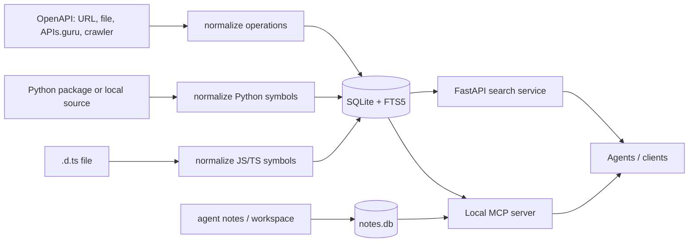

# Mneme

[](https://github.com/Joshwani/mneme/actions/workflows/test.yml)
[](https://pypi.org/project/mneme-server/)
[](https://pypi.org/project/mneme-server/)
[](LICENSE)
[](https://github.com/Joshwani/mneme/pkgs/container/mneme)

**A self-hosted catalog of callables and persistent memory for AI agents.**

Mneme is a small, local-first indexer and search service. An LLM agent consults it to find the right HTTP API operation, library symbol, or saved note, and then pulls a minimal slice instead of dumping entire docs into context. Published on PyPI as [`mneme-server`](https://pypi.org/project/mneme-server/); the CLI is `mneme`.

The searchable unit is **a callable** — not "an API" or "a library." That can be:

- an OpenAPI operation (e.g., `POST /v1/refunds`),
- a Python library symbol (e.g., `matplotlib.axes._axes.Axes.plot`),
- a JavaScript/TypeScript library symbol (e.g., `axios.create`),
- a saved note in the agent's persistent memory.

All four live in the same SQLite + FTS5 index and are searchable from one MCP tool: `search_callables`.

## Quickstart

```bash
pip install mneme-server
mneme demo                            # indexes a bundled spec, runs a search
mneme mcp-config --client cursor      # prints ready-to-paste MCP config
mneme doctor                          # environment diagnostics
```

The default index lives in a per-user directory (XDG-aware), so subsequent commands work without `--db`.

Want it on real APIs? `mneme crawl-seeds examples/seeds.popular.txt` ingests GitHub, Stripe, Slack, DigitalOcean, Twilio, and others.

## Live demo: build a strategy across two libraries

This is what library indexing looks like end to end. Given `yfinance` (finance) and `matplotlib` (charting), an agent asks Mneme three small questions, then assembles a working SMA crossover chart for AAPL.

```bash
pip install 'mneme-server[pylib]' yfinance matplotlib

mneme add-pylib yfinance       # 472 symbols  in ~0.3s
mneme add-pylib matplotlib     # 6.6k symbols in ~3s

mneme search-callables "download daily price history" --package yfinance --limit 3
# →  yfinance.scrapers.history.PriceHistory.history(period, interval, start, end, ...) -> pd.DataFrame
#    yfinance.download(tickers, start, end, auto_adjust, ...) -> pd.DataFrame
#    yfinance.tickers.Tickers.download(...)

mneme search-callables "plot two line series on the same axes" --package matplotlib --limit 3
# →  matplotlib.axes._axes.Axes.plot(*args, scalex, scaley, data, **kwargs) -> list[Line2D]
#    matplotlib.axes._axes.Axes.axvline(x, ymin, ymax, **kwargs) -> Line2D
#    matplotlib.axes._axes.Axes.axhline(y, xmin, xmax, **kwargs) -> Line2D

mneme search-callables "shade a region between two values" --package matplotlib --limit 3
# →  matplotlib.axes._axes.Axes.fill_between(x, y1, y2=0, where=None, ...) -> PolyCollection
#    matplotlib.axes._axes.Axes.fill_betweenx(y, x1, x2=0, where=None, ...) -> PolyCollection
#    matplotlib.collections.FillBetweenPolyCollection
```

Each hit is a compact card with the signature, docstring summary, and a `symbol_id` the agent can pass to `get_library_symbol` for the full slice. Using those three hits, an agent can write:

```python
import yfinance as yf
import matplotlib.pyplot as plt

prices = yf.download("AAPL", start="2023-01-01", end="2024-06-01",
                     auto_adjust=True, progress=False)
close = prices["Close"].squeeze()

sma_fast = close.rolling(20).mean()
sma_slow = close.rolling(50).mean()
long_signal = sma_fast > sma_slow

fig, ax = plt.subplots(figsize=(10, 5))
ax.plot(close.index, close,     label="AAPL close", color="black")
ax.plot(sma_fast.index, sma_fast, label="SMA(20)",   color="tab:blue")
ax.plot(sma_slow.index, sma_slow, label="SMA(50)",   color="tab:orange")
ax.fill_between(close.index, close.min(), close.max(),
                where=long_signal, alpha=0.08, color="tab:green", label="long")
ax.set_title("AAPL — 20/50 SMA crossover")
ax.legend(loc="upper left")
fig.savefig("aapl_sma.png", dpi=110)
```

The complete script is in [`examples/sma_strategy.py`](examples/sma_strategy.py). The point: the agent didn't need yfinance's or matplotlib's full docs in its context — just three targeted hits.

## Why callable-level search?

An agent rarely needs the entire Stripe, GitHub, or matplotlib API. It needs to find callables that match a task:

- `POST /repos/{owner}/{repo}/issues`
- `POST /v1/refunds`
- `matplotlib.axes._axes.Axes.errorbar`
- `the note I saved about our auth flow`

Mneme indexes each callable with a compact agent-facing summary, required inputs, auth metadata, response fields (for HTTP), signatures and docstrings (for library symbols), provenance, and a minimal usage slice. Search returns a small list; the agent then pulls only the slice it actually needs.

## Architecture



## Features

- **HTTP / OpenAPI**: conservative discovery crawler, direct URL/file ingestion, APIs.guru bulk import, normalized operation cards, auth-aware request preparation, and guarded HTTP execution.
- **Python library indexing** via [`griffe`](https://mkdocstrings.github.io/griffe/) — static analysis, never executes user code.
- **JS/TS library indexing** via [`tree-sitter-typescript`](https://github.com/tree-sitter/tree-sitter-typescript) parsing of `.d.ts` files — no Node runtime required.
- **Unified search** across HTTP operations and library symbols (`search_callables`).
- **Agent memory**: FTS5-backed notebook + opt-in scoped file workspace, stored in a separate `notes.db`.
- **Local MCP server** with auth profile redaction and dry-run-by-default HTTP execution.
- **Self-hostable**: SQLite-only, no Postgres or vector DB required. Docker Compose, systemd, cron, and GitHub Actions examples included.

## Install

From PyPI:

```bash
pip install mneme-server                  # base
pip install 'mneme-server[mcp]'           # with MCP server
pip install 'mneme-server[libraries]'     # with Python + JS/TS indexers
pip install 'mneme-server[mcp,libraries]' # everything
```

From source:

```bash
git clone https://github.com/Joshwani/mneme.git
cd mneme
python -m venv .venv
source .venv/bin/activate
python -m pip install -e '.[dev,mcp,libraries]'
```

## CLI cheatsheet

```bash
# one-command demo
mneme demo

# index sources
mneme add-file examples/specs/todo.yaml
mneme add-spec https://example.com/openapi.yaml
mneme discover example.com --ingest
mneme crawl-seeds examples/seeds.popular.txt
mneme ingest-apis-guru --limit 25

# library indexing
mneme add-pylib httpx                                  # an installed package
mneme add-pylib mymod --source-dir ./src               # a local source tree
mneme add-jslib --package axios --file ./axios.d.ts
mneme list-libraries

# unified search
mneme search "create a todo with a due date"            # HTTP-only shortcut
mneme search-callables "create a request"               # all kinds
mneme search-callables "DataFrame" --language python    # Python lib only
mneme search-callables "post" --package httpx           # one package
mneme search-callables "create" --kind pylib_symbol --kind jslib_symbol

# memory: notebook
mneme notes-add --title "T" --body "B" --tag x
mneme notes-search "query"
mneme notes-list

# memory: scoped file workspace (must enable first)
mneme workspace-enable --scope notes --max-mb 10
mneme workspace-write  --scope notes --path a.md --content "..."
mneme workspace-ls     --scope notes

# inspect
mneme stats
mneme doctor

# serve / run as MCP
mneme serve --host 127.0.0.1 --port 8080
mneme mcp-server
mneme mcp-config --client cursor
```

All commands accept `--db <path>` to override the per-user default.

## Library indexing in depth

Library symbols (functions, classes, methods, interfaces, type aliases, enums) live in the same SQLite + FTS5 index as HTTP operations. They surface in `search_callables` with `kind="pylib_symbol"` or `kind="jslib_symbol"`.

### Python via `griffe`

```bash
pip install 'mneme-server[pylib]'

mneme add-pylib httpx                          # an installed package
mneme add-pylib mymod --source-dir ./src       # a local source tree
mneme search-callables "create a request" --language python
```

Notes:

- Static analysis only — Mneme never imports or executes user code.
- The package must be installed in the current Python environment, or `--source-dir` must be provided.
- Private names (`_foo`, `_Bar`) and dunder names (`__init__`, `__repr__`) are skipped.
- Class re-exports are deduplicated by canonical path so methods appear once.

### JavaScript / TypeScript via `.d.ts`

```bash
pip install 'mneme-server[jslib]'

mneme add-jslib --package axios --file ./node_modules/axios/index.d.ts
mneme add-jslib --package @types/node --file ./node_modules/@types/node/fs.d.ts
mneme search-callables "axios.create"
```

Notes:

- `tree-sitter-typescript` parses `.d.ts` files; no Node/npm required at runtime.
- Currently you supply a local `.d.ts` file (pulling tarballs from the npm registry is on the roadmap).
- Captured kinds: `function`, `class` (+ its `method`s), `interface`, `type`, `enum`.
- JSDoc comments immediately preceding a declaration become the docstring.

## Memory: notebook + workspace

Two memory primitives, both stored in a separate `notes.db` so you can back up, sync, or wipe agent memory without touching the API catalog.

### Notebook

A persistent, FTS5-searchable scratch pad — design decisions, gotchas, "here's the call that works."

```bash
mneme notes-add --title "Stripe refund flow" \
  --body "POST /v1/refunds needs payment_id, amount. 25h refund window." \
  --tag stripe --tag payments

mneme notes-search refund
mneme notes-list --scope finops
mneme notes-get note_<id>
mneme notes-update note_<id> --body "New body"
mneme notes-delete note_<id>
```

Notes have optional `tags`, an optional free-text `scope` (project name or task ID), and microsecond-resolution timestamps for stable ordering.

### Scoped file workspace (off by default)

A small, opt-in directory the agent can read and write within. **The workspace is OFF until you explicitly enable a scope**, and the agent cannot create new scopes via MCP.

```bash
mneme workspace-enable --scope notes --max-mb 10
mneme workspace-write  --scope notes --path daily.md --content "## 2026-05-24"
mneme workspace-ls     --scope notes
mneme workspace-read   --scope notes --path daily.md
mneme workspace-rm     --scope notes --path daily.md
mneme workspace-disable --scope notes              # keeps files on disk
mneme workspace-disable --scope notes --remove-files
```

Safety invariants:

- scopes must match `[a-zA-Z0-9_][a-zA-Z0-9_.\-]{0,63}`;
- paths cannot escape the scope directory (`..` segments and symlinks are rejected);
- per-file size limit (1 MiB default);
- per-scope quota (10 MiB default, configurable via `--max-mb`);
- the agent cannot enable or disable scopes through MCP — only the human operator can.

## Local MCP server

Mneme runs as a local MCP server. API credentials and notes stay on the user's machine.

```bash
python -m pip install -e '.[mcp]'
mneme mcp-server                          # stdio (default)
mneme mcp-server --transport streamable-http
```

Tools exposed:

```text
# Unified callable search (HTTP + library symbols)
search_callables           # unified search; restrict via kinds=[...]
get_library_symbol         # full symbol card for a symbol_id
list_libraries             # list indexed library packages

# OpenAPI / HTTP
index_openapi_url          # fetch and index one remote OpenAPI spec URL
search_operations          # HTTP-only operation search
get_operation              # full normalized operation card
get_spec_slice             # minimal OpenAPI-style operation slice
get_call_template          # non-executing request template
list_local_auth_profiles   # local auth profiles without secrets
prepare_http_call          # redacted prepared request, no network traffic
execute_http_call          # dry-run by default; real calls require confirm=true
mneme_stats                # local index stats

# Memory: notebook
notes_search               # full-text search the agent's notebook
notes_get                  # fetch a note by ID
notes_list                 # list recent notes, optionally by scope/tag
notes_add                  # add a new note
notes_update               # update an existing note
notes_delete               # delete a note

# Memory: scoped file workspace (off by default)
workspace_status           # list enabled scopes and current usage
workspace_ls               # list files in a scope
workspace_read             # read a file in a scope
workspace_write            # write a file in a scope (must be enabled first)
workspace_rm               # remove a file in a scope
```

Print a paste-ready config for your client:

```bash
mneme mcp-config --client cursor      # ~/.cursor/mcp.json or repo .cursor/mcp.json
mneme mcp-config --client claude      # Claude Desktop
mneme mcp-config --client continue    # Continue.dev
mneme mcp-config --client generic     # bare mcpServers snippet
mneme mcp-config --client cursor --auth-config ~/.config/mneme/auth.json
```

## Local auth profiles

Auth profiles are JSON files mapping a friendly profile name to credentials stored in environment variables. Agents see profile names and redacted previews, never raw secrets.

Default path: `~/.config/mneme/auth.json`.

Example:

```json
{
  "profiles": {
    "github": {
      "provider_domain": "api.github.com",
      "base_url": "https://api.github.com",
      "allow_methods": ["GET", "POST", "PATCH"],
      "auth": {
        "type": "bearer",
        "token_env": "GITHUB_TOKEN"
      }
    }
  }
}
```

Prepare a call without sending it:

```bash
mneme prepare-call op_... \
  --auth-config ~/.config/mneme/auth.json \
  --auth-profile github \
  --json-body '{"title":"ship mcp"}'
```

Execute a real call only when explicitly confirmed:

```bash
mneme execute-call op_... \
  --auth-config ~/.config/mneme/auth.json \
  --auth-profile github \
  --json-body '{"title":"ship mcp"}' \
  --send --confirm
```

Guardrails:

- dry-run is the default for the MCP and CLI executor;
- real HTTP execution requires `confirm=true` / `--confirm`;
- mutating unauthenticated calls are blocked;
- auth profiles can restrict allowed HTTP methods and hosts;
- `MNEME_HTTP_ALLOW_HOSTS` can globally restrict execution hosts.

## HTTP Search API

### `POST /search`

```json
{
  "query": "create a refund for a previous payment",
  "limit": 10,
  "filters": {
    "method": "POST",
    "provider_domain": null,
    "auth_required": null
  },
  "token_budget": 4000
}
```

Other endpoints:

```text
GET  /health
GET  /stats
GET  /search?q=create%20todo
GET  /operations/{operation_id}
GET  /operations/{operation_id}/spec-slice
GET  /operations/{operation_id}/call-template
POST /operations/{operation_id}/prepare-call
POST /operations/{operation_id}/execute-call
```

## Database location

Mneme picks sensible default paths so commands work without `--db`:

| Use | Resolution order |
| --- | --- |
| OpenAPI/library index | `$MNEME_DB` → `$XDG_DATA_HOME/mneme/mneme.db` → `~/.local/share/mneme/mneme.db` → `%LOCALAPPDATA%\mneme\mneme.db` |
| Notes index | `$MNEME_NOTES_DB` → `$XDG_DATA_HOME/mneme/notes.db` → `~/.local/share/mneme/notes.db` → `%LOCALAPPDATA%\mneme\notes.db` |
| Workspace root | `$MNEME_WORKSPACE_ROOT` → `$XDG_DATA_HOME/mneme/workspace/` → `~/.local/share/mneme/workspace/` → `%LOCALAPPDATA%\mneme\workspace\` |

Override the index path with `--db /path/to/mneme.db` and the notes DB with `--notes-db /path/to/notes.db` on memory subcommands.

## Self-host with Docker Compose

```bash
cd deploy
docker compose up --build -d
```

Ingest the demo spec into the Docker volume:

```bash
docker compose run --rm mneme \
  mneme --db /data/mneme.db add-file /examples/specs/todo.yaml
```

```bash
curl -s -X POST http://127.0.0.1:8080/search \
  -H 'content-type: application/json' \
  -d '{"query":"create a todo","limit":3}' | jq
```

Pre-built container images are published to GHCR on tagged releases:

```bash
docker pull ghcr.io/joshwani/mneme:latest
```

## Self-host crawler deployment

The recommended deployment model is bring-your-own-infra:

1. Run the API container or systemd service.
2. Store the SQLite index on a persistent volume.
3. Keep a curated `seeds.txt` of domains and spec URLs.
4. Run `mneme crawl-seeds` from cron or another scheduler.
5. Back up the SQLite file like any other application data.

Example cron entry:

```cron
10 2 * * * cd /opt/mneme && /opt/mneme/.venv/bin/mneme --db /var/lib/mneme/mneme.db crawl-seeds /etc/mneme/seeds.txt >> /var/log/mneme-crawl.log 2>&1
```

## Troubleshooting

Run `mneme doctor` first. It prints the resolved DB path, index size, installed extras, and a network reachability check. Most reports should include its output.

Common issues:

- **Empty search results.** The index is empty. Run `mneme demo`, `mneme crawl-seeds examples/seeds.popular.txt`, or `mneme add-pylib <pkg>`.
- **MCP server fails to start with an ImportError.** The optional MCP extra isn't installed. Run `pip install 'mneme-server[mcp]'`.
- **`mneme mcp-config --client cursor` shows `command: mneme` instead of an absolute path.** The `mneme` binary isn't on `PATH` in the shell that launches your MCP client. Activate the venv first, or edit `command` to the absolute path printed by `which mneme`.
- **401/403 when executing a call.** Check `mneme auth-profiles --auth-config ~/.config/mneme/auth.json` and confirm the referenced `*_env` environment variable is set in the launching shell.
- **"host not allowed" errors when executing.** Either widen `allow_methods` / `allowed_hosts` in your profile, or relax `MNEME_HTTP_ALLOW_HOSTS`.

## When to move beyond SQLite

SQLite + FTS5 is enough for the MVP and for private/team indexes. Move to a larger architecture when you need concurrent crawler workers, millions of callables, vector retrieval, public multi-tenant search, owner verification flows, or moderation/takedown flows.

A later hosted architecture could use object storage for raw specs, Postgres for metadata, Tantivy / Meilisearch / OpenSearch for lexical search, pgvector / Qdrant / LanceDB for embeddings, a queue for crawler jobs, and a read-only search API for agents.

## Crawl policy

The MVP is intentionally conservative. It should index intentionally published API descriptions, not private or accidentally exposed internal specs. Recommended rules for operators:

- crawl only submitted domains, submitted URLs, known public directories, and API discovery endpoints;
- respect rate limits and robots/policy pages where applicable;
- do not index specs requiring authentication;
- store provenance for every spec;
- provide opt-out or takedown instructions if operating a public index.

## Development

```bash
python -m pip install -e '.[dev,mcp,libraries]'
ruff check
ruff format --check
pytest
```

See [CONTRIBUTING.md](CONTRIBUTING.md) for details and [CHANGELOG.md](CHANGELOG.md) for release notes.

## Roadmap

- Library indexing from npm tarballs (right now you supply a local `.d.ts`).
- Library indexing from PyPI sdists/wheels (right now the package must be installed or have a local source).
- Hybrid retrieval (BM25 + embeddings) for callable search.
- Owner-verified submissions via DNS TXT or GitHub repo verification.
- Better RFC 9727 Linkset parsing.
- Duplicate clustering by callable similarity.
- Reranking with task/callable labels.
- Callable graph edges for multi-step workflows.
- Public benchmark: natural-language task → expected callable IDs.

## License

[Apache License 2.0](LICENSE).
