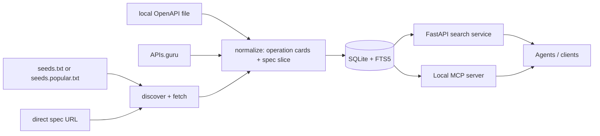

# OAS Atlas

[](https://github.com/Joshwani/oas-atlas/actions/workflows/test.yml)
[](https://pypi.org/project/oas-atlas/)
[](https://pypi.org/project/oas-atlas/)
[](LICENSE)
[](https://github.com/Joshwani/oas-atlas/pkgs/container/oas-atlas)

**Agent-optimized search over the OpenAPI specs you use every day.**

OAS Atlas is a small, self-hostable indexer and search service for OpenAPI documents. It turns thousands of operations across many APIs into a searchable, agent-friendly catalog so an LLM can find the right operation, retrieve a minimal schema slice, and (optionally) call it.

The searchable unit is not "an API." It is **an operation** — `POST /v1/refunds`, `POST /repos/{owner}/{repo}/issues`, `POST /messages`, and so on.

## Quickstart in 60 seconds

```bash
pip install oas-atlas
oas-atlas demo                          # indexes a bundled spec, runs a search
oas-atlas mcp-config --client cursor    # prints ready-to-paste MCP config
oas-atlas doctor                        # environment diagnostics
```

That is it. The default index lives in a per-user directory (XDG-aware), so subsequent commands work without `--db`.

> Want to see it on real APIs? `oas-atlas crawl-seeds examples/seeds.popular.txt` will pull in GitHub, Stripe, Slack, DigitalOcean, Twilio, and others.

## Why operation-level search?

An agent rarely needs the entire Stripe, GitHub, or Slack API in context. It needs to find operations that match a task, like:

- `POST /repos/{owner}/{repo}/issues`
- `POST /v1/refunds`
- `GET /customers/{id}/invoices`
- `POST /messages`

OAS Atlas indexes each operation with a compact agent-facing summary, required inputs, auth metadata, response fields, provenance, and a minimal spec slice. Search returns a small list; the agent then pulls only the operation slice it actually needs.

## Architecture



## What you get

- A conservative OpenAPI discovery crawler for a domain.
- Direct ingestion for OpenAPI/Swagger URLs and local files.
- APIs.guru bulk ingestion for bootstrapping a public corpus.
- A normalizer that converts each HTTP method/path into a compact operation card.
- SQLite + FTS5 operation search (no Postgres, no vector DB required).
- A FastAPI search service for agents.
- A local MCP server with search, spec retrieval, auth-aware request preparation, and guarded HTTP execution.
- Docker Compose, systemd, cron, and GitHub Actions examples.

## Install

From source while the project is pre-PyPI:

```bash
git clone https://github.com/Joshwani/oas-atlas.git
cd oas-atlas
python -m venv .venv
source .venv/bin/activate
python -m pip install -e '.[dev]'
# include MCP support when you want the local MCP server
python -m pip install -e '.[dev,mcp]'
```

## CLI cheatsheet

```bash
# one-command demo
oas-atlas demo

# index sources
oas-atlas add-file examples/specs/todo.yaml
oas-atlas add-spec https://example.com/openapi.yaml
oas-atlas discover example.com --ingest
oas-atlas crawl-seeds examples/seeds.popular.txt
oas-atlas ingest-apis-guru --limit 25

# search
oas-atlas search "create a todo with a due date"
oas-atlas search "create refund" --method POST --provider-domain api.stripe.com

# inspect
oas-atlas stats
oas-atlas doctor

# serve / run as MCP
oas-atlas serve --host 127.0.0.1 --port 8080
oas-atlas mcp-server
oas-atlas mcp-config --client cursor
```

All commands accept `--db <path>` to override the per-user default.

## Popular APIs starter pack

`examples/seeds.popular.txt` is a curated list of stable, public OpenAPI documents you can ingest in one shot:

```bash
oas-atlas crawl-seeds examples/seeds.popular.txt
oas-atlas stats
```

To suggest an API for the starter pack, open an issue using the **Add a public API to the starter index** template.

## Local MCP server

OAS Atlas runs as a local MCP server. API credentials stay on the user's machine.

```bash
python -m pip install -e '.[mcp]'
oas-atlas mcp-server                          # stdio (default)
oas-atlas mcp-server --transport streamable-http
```

Tools exposed:

```text
search_operations          # natural-language operation search
get_operation              # full normalized operation card
get_spec_slice             # minimal OpenAPI-style operation slice
get_call_template          # non-executing request template
list_local_auth_profiles   # local auth profiles without secrets
prepare_http_call          # redacted prepared request, no network traffic
execute_http_call          # dry-run by default; real calls require confirm=true
atlas_stats                # local index stats
```

Print a paste-ready config for your client:

```bash
oas-atlas mcp-config --client cursor      # ~/.cursor/mcp.json or repo .cursor/mcp.json
oas-atlas mcp-config --client claude      # Claude Desktop
oas-atlas mcp-config --client continue    # Continue.dev
oas-atlas mcp-config --client generic     # bare mcpServers snippet
oas-atlas mcp-config --client cursor --auth-config ~/.config/oas-atlas/auth.json
```

## Local auth profiles

Auth profiles are JSON files mapping a friendly profile name to credentials stored in environment variables. Agents see profile names and redacted previews, never raw secrets.

Default path:

```text
~/.config/oas-atlas/auth.json
```

Example:

```json
{
  "profiles": {
    "github": {
      "provider_domain": "api.github.com",
      "base_url": "https://api.github.com",
      "allow_methods": ["GET", "POST", "PATCH"],
      "auth": {
        "type": "bearer",
        "token_env": "GITHUB_TOKEN"
      }
    },
    "todo-local": {
      "provider_domain": "api.example.test",
      "base_url": "https://api.example.test",
      "allow_methods": ["GET", "POST"],
      "auth": {
        "type": "api_key",
        "in": "header",
        "name": "X-API-Key",
        "value_env": "TODO_API_KEY"
      }
    }
  }
}
```

List profiles without leaking secrets:

```bash
oas-atlas auth-profiles --auth-config ~/.config/oas-atlas/auth.json
```

Prepare a call without sending it:

```bash
oas-atlas prepare-call op_... \
  --auth-config ~/.config/oas-atlas/auth.json \
  --auth-profile todo-local \
  --json-body '{"title":"ship mcp"}'
```

Execute a real call only when explicitly confirmed:

```bash
oas-atlas execute-call op_... \
  --auth-config ~/.config/oas-atlas/auth.json \
  --auth-profile todo-local \
  --json-body '{"title":"ship mcp"}' \
  --send --confirm
```

Guardrails:

- dry-run is the default for the MCP and CLI executor;
- real HTTP execution requires `confirm=true` / `--confirm`;
- mutating unauthenticated calls are blocked;
- auth profiles can restrict allowed HTTP methods and hosts;
- `OAS_ATLAS_HTTP_ALLOW_HOSTS` can globally restrict execution hosts.

## HTTP Search API

### `POST /search`

```json
{
  "query": "create a refund for a previous payment",
  "limit": 10,
  "filters": {
    "method": "POST",
    "provider_domain": null,
    "auth_required": null
  },
  "token_budget": 4000
}
```

Response:

```json
{
  "query": "create a refund for a previous payment",
  "results": [
    {
      "operation_id": "op_...",
      "score": 1.06,
      "api_title": "Example Payments API",
      "provider_domain": "api.example.com",
      "method": "POST",
      "path": "/v1/refunds",
      "summary": "Create a refund",
      "why_relevant": "Creates a full or partial refund for an existing payment.",
      "auth_required": true,
      "required_inputs": ["payment_id", "amount"],
      "links": {
        "operation": "/operations/op_...",
        "spec_slice": "/operations/op_.../spec-slice",
        "call_template": "/operations/op_.../call-template"
      }
    }
  ]
}
```

### Other endpoints

```text
GET  /health
GET  /stats
GET  /search?q=create%20todo
GET  /operations/{operation_id}
GET  /operations/{operation_id}/spec-slice
GET  /operations/{operation_id}/call-template
POST /operations/{operation_id}/prepare-call
POST /operations/{operation_id}/execute-call
```

## Database location

OAS Atlas picks a sensible default path so commands work without `--db`:

1. `$OAS_ATLAS_DB` if set
2. `$XDG_DATA_HOME/oas-atlas/oas_atlas.db` if set
3. `~/.local/share/oas-atlas/oas_atlas.db` on Linux/macOS
4. `%LOCALAPPDATA%\oas-atlas\oas_atlas.db` on Windows

Override at any time with `--db /path/to/oas_atlas.db`.

## Self-host with Docker Compose

```bash
cd deploy
docker compose up --build -d
```

Ingest the demo spec into the Docker volume:

```bash
docker compose run --rm oas-atlas \
  oas-atlas --db /data/oas_atlas.db add-file /examples/specs/todo.yaml
```

```bash
curl -s -X POST http://127.0.0.1:8080/search \
  -H 'content-type: application/json' \
  -d '{"query":"create a todo","limit":3}' | jq
```

Pre-built container images are published to GHCR on tagged releases:

```bash
docker pull ghcr.io/joshwani/oas-atlas:latest
```

## Self-host crawler deployment

For now, the recommended deployment model is bring-your-own-infra:

1. Run the API container or systemd service.
2. Store the SQLite index on a persistent volume.
3. Keep a curated `seeds.txt` file of domains and spec URLs.
4. Run `oas-atlas crawl-seeds` from cron or another scheduler.
5. Back up the SQLite file like any other application data.

Example cron entry:

```cron
10 2 * * * cd /opt/oas-atlas && /opt/oas-atlas/.venv/bin/oas-atlas --db /var/lib/oas-atlas/oas_atlas.db crawl-seeds /etc/oas-atlas/seeds.txt >> /var/log/oas-atlas-crawl.log 2>&1
```

## Troubleshooting

Run `oas-atlas doctor` first. It prints the resolved DB path, index size, installed extras, and a network reachability check. Most reports should include its output.

Common issues:

- **"operation not found" or empty search results.** The index is empty. Run `oas-atlas demo` or `oas-atlas crawl-seeds examples/seeds.popular.txt`.
- **MCP server fails to start with an ImportError.** The optional MCP extra isn't installed. Run `python -m pip install -e '.[mcp]'` (or `pip install 'oas-atlas[mcp]'`).
- **`oas-atlas mcp-config --client cursor` shows `command: oas-atlas` instead of an absolute path.** The `oas-atlas` binary isn't on PATH in the shell that launches your MCP client. Activate the venv first or pass `--db <absolute>` plus edit `command` to the absolute path printed by `which oas-atlas`.
- **401/403 when executing a call.** Check `oas-atlas auth-profiles --auth-config ~/.config/oas-atlas/auth.json` and confirm the referenced `*_env` environment variable is set in the launching shell.
- **"host not allowed" errors when executing.** Either widen `allow_methods` / `allowed_hosts` in your profile, or unset/relax `OAS_ATLAS_HTTP_ALLOW_HOSTS`.

## When to move beyond SQLite

SQLite + FTS5 is enough for the MVP and for private/team indexes. Move to a larger architecture when you need:

- concurrent crawler workers,
- millions of operations,
- vector retrieval,
- public multi-tenant search,
- owner verification workflows,
- moderation/takedown flows,
- crawl queues and retry policies.

A later hosted architecture could use:

- object storage for raw specs,
- Postgres for metadata,
- Tantivy / Meilisearch / OpenSearch for lexical search,
- pgvector / Qdrant / LanceDB for embeddings,
- a queue for crawler jobs,
- a read-only search API for agents.

## Crawl policy

The MVP is intentionally conservative. It should index intentionally published API descriptions, not private or accidentally exposed internal specs.

Recommended rules for operators:

- crawl only submitted domains, submitted URLs, known public directories, and API discovery endpoints;
- respect rate limits and robots/policy pages where applicable;
- do not index specs requiring authentication;
- store provenance for every spec;
- provide opt-out or takedown instructions if operating a public index;
- rank owner-verified specs above community/crawler-discovered specs.

## Development

```bash
python -m pip install -e '.[dev,mcp]'
ruff check
ruff format --check
pytest
```

See [CONTRIBUTING.md](CONTRIBUTING.md) for details and [CHANGELOG.md](CHANGELOG.md) for release notes.

## Roadmap

- Owner-verified submissions via DNS TXT or GitHub repo verification.
- Better RFC 9727 Linkset parsing.
- Better APIs.json support.
- Duplicate clustering by operation similarity.
- Hybrid lexical + embedding retrieval.
- Reranking with task/operation labels.
- Operation graph edges for multi-step workflows.
- Public benchmark: natural-language task to expected operation IDs.

## License

[Apache License 2.0](LICENSE).
