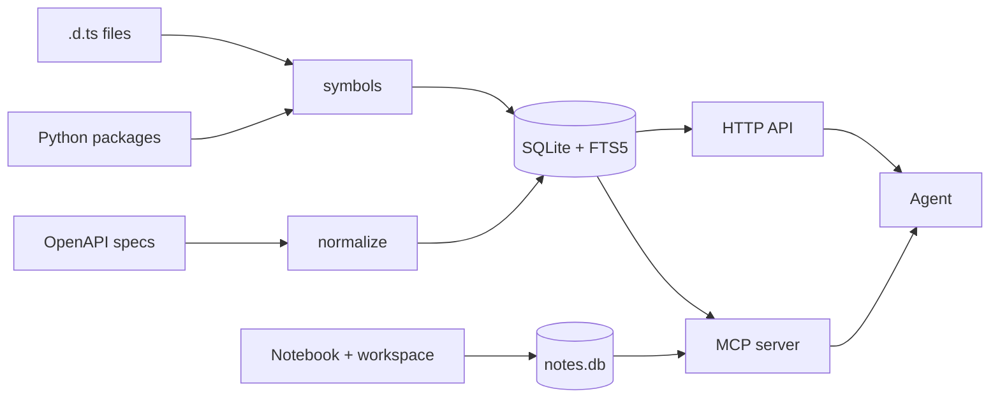
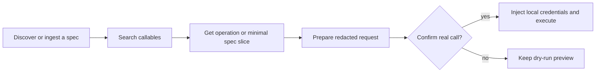

# mneme

[](https://github.com/Joshwani/mneme/actions/workflows/test.yml)
[](https://pypi.org/project/mneme-server/)
[](https://pypi.org/project/mneme-server/)
[](LICENSE)
[](https://github.com/Joshwani/mneme/pkgs/container/mneme)

**A local tool catalog, credential-aware HTTP gateway, and persistent memory for AI agents.**

Mneme gives coding agents one local interface to search OpenAPI operations and
Python or JavaScript/TypeScript library symbols, retrieve only the context they
need, and safely prepare or execute authenticated HTTP calls. Auth profiles,
indexes, notes, and workspace files stay on your machine.

Published on PyPI as [`mneme-server`](https://pypi.org/project/mneme-server/); the CLI is `mneme`.
Mneme is currently alpha software.

### What Mneme is — and is not

- **Local callable search:** SQLite + FTS5 indexes for OpenAPI operations and
  statically analyzed library symbols.
- **Local auth policy:** reusable profiles resolve environment-backed credentials
  locally while agents receive redacted previews.
- **Guarded HTTP execution:** host and method allowlists, dry runs by default,
  and explicit confirmation for real requests.
- **Agent memory:** a separate searchable notebook and opt-in scoped workspace.

Mneme indexes sources you explicitly ingest. It is not an MCP tool registry and
does not automatically discover arbitrary tools, CLI commands, or MCP server
definitions in a project.

## Quickstart

```bash
pip install mneme-server
mneme demo                            # index a bundled spec, run a sample search
mneme mcp-config --client cursor      # paste-ready MCP config
mneme doctor                          # environment diagnostics
```

Index popular public APIs in one shot:

```bash
mneme crawl-seeds examples/seeds.popular.txt
```

The default index lives in a per-user directory (XDG-aware), so later commands work without `--db`.

## What gets indexed

Mneme searches **callables** — individual things an agent can invoke:

| Kind | Example |
|------|---------|
| HTTP operation | `POST /v1/refunds` |
| Python symbol | `httpx.Client.get` |
| JS/TS symbol | `axios.create` |

These callable kinds share `mneme.db` and the MCP tool `search_callables`.
Agent notes are intentionally separate: they live in `notes.db` and use
`notes_search`.



## Agent workflow



The same MCP server exposes library lookup, notes, and workspace tools, so an
agent can move from discovery to action without loading full API specifications
or secret values into model context.

## Install

```bash
pip install mneme-server              # base CLI + HTTP API
pip install 'mneme-server[mcp]'       # + local MCP server
pip install 'mneme-server[libraries]' # + Python + JS/TS library indexing
```

From source:

```bash
git clone https://github.com/Joshwani/mneme.git && cd mneme
python -m venv .venv && source .venv/bin/activate
python -m pip install -e '.[dev,mcp,libraries]'
```

## CLI

```bash
# index
mneme add-file examples/specs/todo.yaml
mneme add-spec https://example.com/openapi.yaml
mneme discover example.com --ingest
mneme crawl-seeds examples/seeds.popular.txt
mneme add-pylib httpx
mneme add-jslib --package axios --file ./axios.d.ts

# search
mneme search "create refund" --method POST
mneme search-callables "create request" --kind http_operation

# memory
mneme notes-add --title "T" --body "B" --tag x
mneme notes-search "query"
mneme workspace-enable --scope notes --max-mb 10
mneme workspace-write --scope notes --path a.md --content "..."

# serve
mneme serve --host 127.0.0.1 --port 8080
mneme mcp-server
mneme stats
mneme doctor
```

Use `--db <path>` to override the default index path.

## MCP server

Mneme runs locally over stdio by default and also supports streamable HTTP and
SSE transports.

```bash
pip install 'mneme-server[mcp]'
mneme mcp-server
mneme mcp-config --client cursor      # Cursor
mneme mcp-config --client claude      # Claude Desktop
mneme mcp-config --client continue    # Continue.dev
```

Main tools include:

- Search and inspection: `search_callables`, `search_operations`,
  `get_operation`, `get_spec_slice`, `get_call_template`,
  `get_library_symbol`, `list_libraries`, `catalog_summary`
- Authenticated HTTP: `list_local_auth_profiles`, `prepare_http_call`,
  `execute_http_call`
- Memory: `notes_*`, `workspace_*`
- Diagnostics: `mneme_stats`

HTTP execution is dry-run by default; real calls require explicit confirmation.
Search across API and library callables is available through MCP and the CLI.
The HTTP API currently exposes OpenAPI operation search and execution only.

### How agents discover indexed capabilities

Mneme exposes a compact set of discovery and execution tools through MCP. The
operations and library symbols selected and indexed by the user intentionally do
not appear as thousands of individual entries in `tools/list`.

The MCP server provides clients with instructions for this search-first workflow:

1. Use `search_callables` for general capability discovery, or
   `search_operations` for HTTP-only tasks.
2. Use `catalog_summary` when exact provider domains, API titles, operation
   counts, or indexed library names are needed.
3. Inspect a returned operation ID with `get_operation` or `get_spec_slice`.
4. Validate HTTP inputs and local authentication with `prepare_http_call`.
5. Use `execute_http_call` only when execution is requested.

Searches should describe the desired task in natural language. If a narrow
search returns no results, retry with broader terms and without optional
provider filters before concluding that the capability is unavailable.

Some MCP clients do not consistently apply server initialization instructions.
The output of `mneme mcp-config` includes a short client-instruction fallback
where appropriate.

## Library indexing

**Python** — static analysis via [`griffe`](https://mkdocstrings.github.io/griffe/) (no code execution):

```bash
pip install 'mneme-server[pylib]'
mneme add-pylib httpx
mneme add-pylib mymod --source-dir ./src
```

**JavaScript/TypeScript** — parse a local `.d.ts` via tree-sitter (no Node required):

```bash
pip install 'mneme-server[jslib]'
mneme add-jslib --package axios --file ./node_modules/axios/index.d.ts
```

## Memory

Two opt-in primitives in a separate `notes.db`:

- **Notebook** — FTS5-backed scratch pad (`notes-add`, `notes-search`, …).
- **Scoped workspace** — small file area for snippets; off until you `workspace-enable` a scope.

## Auth profiles

Auth profiles centralize provider URLs, allowed hosts and methods, and references
to credentials stored in environment variables. Mneme can select a profile by
the operation's provider domain. Agents can list profiles and inspect prepared
requests, but secret values are redacted.

```json
{
  "profiles": {
    "github": {
      "provider_domain": "api.github.com",
      "base_url": "https://api.github.com",
      "allow_methods": ["GET", "POST"],
      "auth": { "type": "bearer", "token_env": "GITHUB_TOKEN" }
    }
  }
}
```

Default path: `~/.config/mneme/auth.json`. Override it with
`MNEME_AUTH_CONFIG`. See `examples/auth.example.json` for a fuller example.

```bash
mneme auth-profiles
mneme prepare-call op_... --auth-profile github --json-body '{}'
mneme execute-call op_... --auth-profile github --send --confirm
```

## HTTP API

```bash
mneme serve --host 127.0.0.1 --port 8080
curl -s -X POST http://127.0.0.1:8080/search \
  -H 'content-type: application/json' \
  -d '{"query":"create a todo","limit":5}'
```

Endpoints: `GET /health`, `GET /stats`, `POST /search`, `GET /operations/{id}`, `GET /operations/{id}/spec-slice`, `POST /operations/{id}/prepare-call`, `POST /operations/{id}/execute-call`.

## Docker

```bash
docker pull ghcr.io/joshwani/mneme:latest
cd deploy && docker compose up --build -d
```

See `deploy/` for systemd, cron, and compose examples.

## Default paths

| What | Env override | Default (Linux/macOS) |
|------|--------------|------------------------|
| API/library index | `MNEME_DB` | `~/.local/share/mneme/mneme.db` |
| Notes index | `MNEME_NOTES_DB` | `~/.local/share/mneme/notes.db` |
| Workspace root | `MNEME_WORKSPACE_ROOT` | `~/.local/share/mneme/workspace/` |
| Auth config | `MNEME_AUTH_CONFIG` | `~/.config/mneme/auth.json` |

## Troubleshooting

Run `mneme doctor` first — it prints resolved paths, index size, installed extras, and a network check.

| Problem | Fix |
|---------|-----|
| Empty search results | Run `mneme demo` or `mneme crawl-seeds examples/seeds.popular.txt` |
| MCP ImportError | `pip install 'mneme-server[mcp]'` |
| 401/403 on execute | Check env vars referenced in your auth profile |
| Host not allowed | Adjust profile `allow_methods` / hosts, or `MNEME_HTTP_ALLOW_HOSTS` |

## Development

```bash
python -m pip install -e '.[dev,mcp,libraries]'
ruff check && ruff format --check && pytest
```

See [CONTRIBUTING.md](CONTRIBUTING.md) and [CHANGELOG.md](CHANGELOG.md).

## License

[Apache License 2.0](LICENSE).
